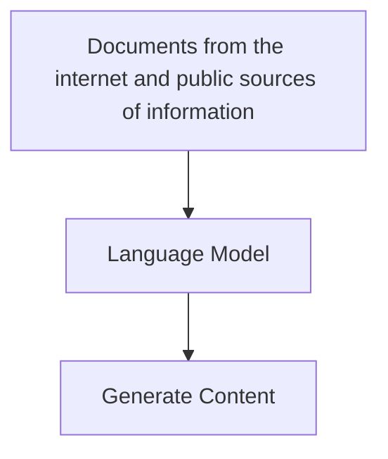

## Fundamental AI Concepts

### Generative AI

- Branch of AI that enables the software applications to generate new content including text content in natural language, images, videos, code and other formats.
- The ability to generate content is based on a language model, which has been trained with huge volumes of data, often documents from the Internet or other public sources of information.

- Generative models can generate meaningful sequence of texts because they know how the words relate to one another in a language (a.k.a semantic relationship between language elements).
- The different between Large Language Models and Small Language Models depends on the volume on data and number of variables in the model.

| LLM                                           | SLM                                     |
| --------------------------------------------- | --------------------------------------- |
| Powerful, Generalize, Costly to train and use | Work well on specific topics, Cost less |

Common uses of GenAI

- Chatbots and AI agents
- Creating new document or other content
- Automated language translation
- Summarizing or explaining complex topics.

## Introduction to Machine Learning

## Fundamentals of Azure AI services
