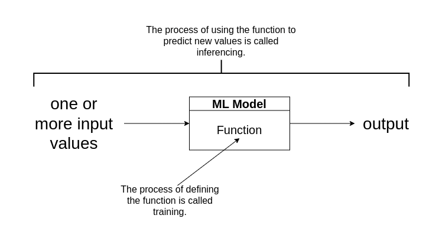
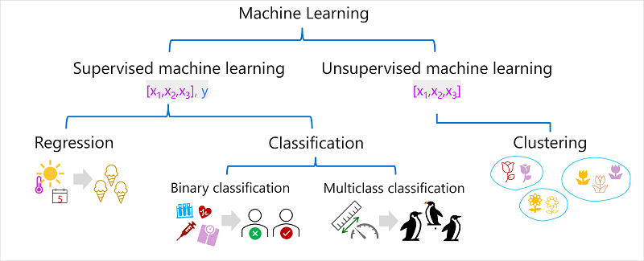

## Introduction

- ML is an intersection of data science and software engineering.
- The goal of ML is to use data to create a predictive model that can be incorporated into a software application or service.
- This goal requires the collaboration of Data Scientists and Software Developer.
- Data Scientists explores and prepares the data before using it to train a machine learning model.
- Software Developers integrated the models into applications where they are used to predict new data values. This process is known as inferencing.

## What is Machine Learning?

- ML has its origins in statistics and mathematical modeling of data.
- The idea of ML is to use the data from past observations to predict unknown outcomes or values.

### For Example:

- The proprietor of an ice cream store might use an app that combines historical sales and weather records to predict how many ice creams they are likely to sell on a given day, based on the weather forecast.

### Machine Learning as a function

- Since ML originates from mathematics and statistics, its a common way to think about ML models in mathematical terms.
- A ML model is a software application that encapsulates a function to calculate an output value based on one of more input values.
- The process of defining this function is known as training.
- After the function has been defined, the process of using it to predict new values is called inferencing.

#### Steps involved in training and inferencing

1. The training data consists of past observations. In most cases the observations include:

   1. Attributes/Features of the thing being observed.
   2. Known value of the thing, a.k.a. Label.

      #### For example

      The observed data in the dataset used to predict house prices includes attributes/features such as size, number of bedrooms, location and age of the house; while the known value/label in this case will be the selling price of the house. Once the model is trained, it can analyze new houses with similar features to predict their prices.

      In mathematical terms, the features are often referred to using the shorthand variable name $x$, and the label referred to as $y$. Usually, an observation consists of multiple features values; hence, x is actually a vector (an array with multiple values) like $[x1, x2, x3]$.

      #### For example

      In the ice cream sales scenario, our goal is to train a model that can predict the number of ice cream sales based on the weather. The weather measurements for the day (temperature, rainfall, windspeed, and so on) would be the features (x), and the number of ice creams sold on each day would be the label (y).

2. An algorithm is applied to the data to try to determine a relationship between the features and label and generalize that relationship as a calculation that can be performed on $x$ to calculate $y$. The basic principle is to try to fit the data to a function in which the values of the features can be used to calculate the label.
3. The result of the algorithm is a model that encapsulates the calculation derived by the algorithm as a function. Lets call it f. In mathematical notation:

   $y = f(x)$

4. After this training phase, the trained model can be used for inferencing. You can input a set of feature values, and receive as an output a prediction of the corresponding label. Because the output from the model is a prediction that was calculated by the function, and not an observed value, you will often see the output from the function shown as $ŷ$.

## Types of Machine Learning

There are multiple types of machine learning, and you must apply the appropriate type depending on what you are trying to predict. A breakdown of common types of machine learning is shown in the following diagram.

### Supervised Machine Learning

- Supervised ML is a term for ML algorithm in which the training data includes both, the feature values and known label values.
- It is used to train models by determining a relationship between the features and labels in past observations.
- This helps the model to predict the unknown labels for the known features.

#### Regression
