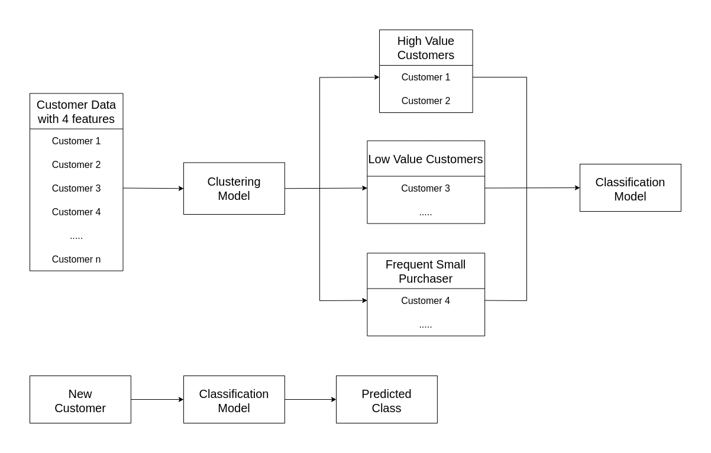
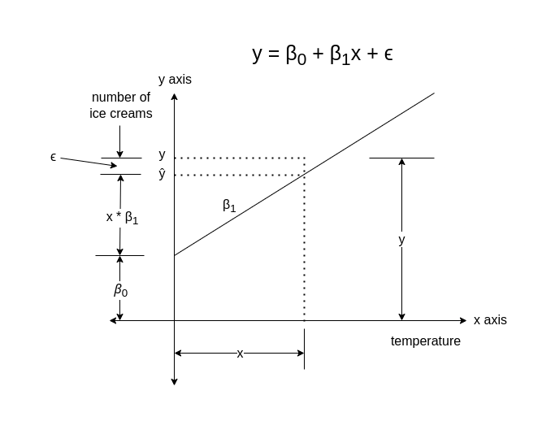
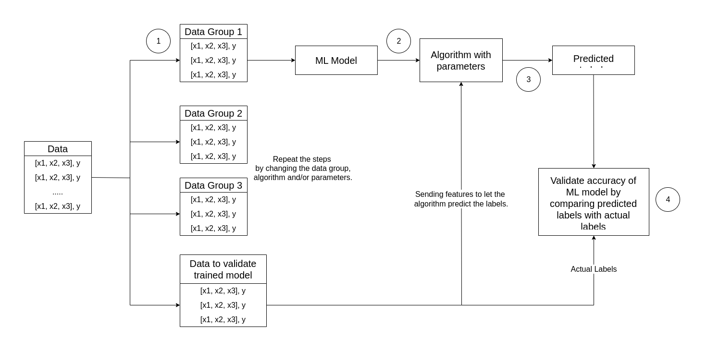
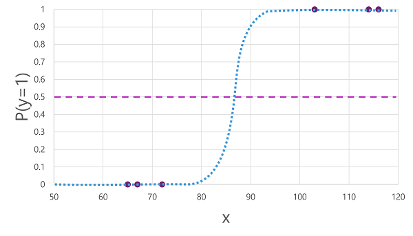
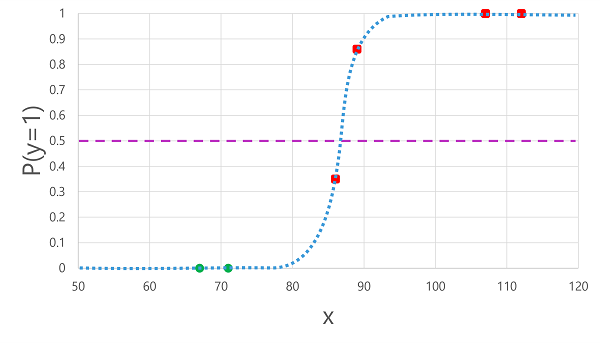

## Introduction

- ML is an intersection of data science and software engineering.
- The goal of ML is to use data to create a predictive model that can be incorporated into a software application or service.
- This goal requires the collaboration of Data Scientists and Software Developer.
- Data Scientists explores and prepares the data before using it to train a machine learning model.
- Software Developers integrated the models into applications where they are used to predict new data values. This process is known as inferencing.

## What is Machine Learning?

- ML has its origins in statistics and mathematical modeling of data.
- The idea of ML is to use the data from past observations to predict unknown outcomes or values.

### For Example:

- The proprietor of an ice cream store might use an app that combines historical sales and weather records to predict how many ice creams they are likely to sell on a given day, based on the weather forecast.

### Machine Learning as a function

- Since ML originates from mathematics and statistics, its a common way to think about ML models in mathematical terms.
- A ML model is a software application that encapsulates a function to calculate an output value based on one of more input values.
- The process of defining this function is known as training.
- After the function has been defined, the process of using it to predict new values is called inferencing.

#### Steps involved in training and inferencing

1. The training data consists of past observations. In most cases the observations include:

   1. Attributes/Features of the thing being observed.
   2. Known value of the thing, a.k.a. Label.

      #### For example

      The observed data in the dataset used to predict house prices includes attributes/features such as size, number of bedrooms, location and age of the house; while the known value/label in this case will be the selling price of the house. Once the model is trained, it can analyze new houses with similar features to predict their prices.

      In mathematical terms, the features are often referred to using the shorthand variable name $x$, and the label referred to as $y$. Usually, an observation consists of multiple features values; hence, x is actually a vector (an array with multiple values) like $[x1, x2, x3]$.

      #### For example

      In the ice cream sales scenario, our goal is to train a model that can predict the number of ice cream sales based on the weather. The weather measurements for the day (temperature, rainfall, windspeed, and so on) would be the features (x), and the number of ice creams sold on each day would be the label (y).

2. An algorithm is applied to the data to try to determine a relationship between the features and label and generalize that relationship as a calculation that can be performed on $x$ to calculate $y$. The basic principle is to try to fit the data to a function in which the values of the features can be used to calculate the label.
3. The result of the algorithm is a model that encapsulates the calculation derived by the algorithm as a function. Lets call it f. In mathematical notation:

   $y = f(x)$

4. After this training phase, the trained model can be used for inferencing. You can input a set of feature values, and receive as an output a prediction of the corresponding label. Because the output from the model is a prediction that was calculated by the function, and not an observed value, you will often see the output from the function shown as $ŷ$.

## Types of Machine Learning

There are multiple types of machine learning, and you must apply the appropriate type depending on what you are trying to predict. A breakdown of common types of machine learning is shown in the following diagram.

### Supervised Machine Learning

- Supervised ML is a term for ML algorithm in which the training data includes both, the feature values and known label values.
- It is used to train models by determining a relationship between the features and labels in past observations.
- This helps the model to predict the unknown labels for the known features.
#### Regression
- Regression is a form of supervised ML in which the label predicted by the model is a numeric value.
##### For Example
- The number of ice creams sold on a given day, based on the temperature, rainfall, and windspeed.
#### Classification
- Classification is a form of supervised ML in which the label represents a categorization or class.
##### Binary Classification
- Binary classification predicts the outcome in boolean. The predicted label can be either true/false or positive/negative.
###### For Example
- Whether a patient is at risk for diabetes based on clinical metrics like weight, age, blood glucose level, and so on.
##### Multiclass Classification
- Multiclass Classification extends binary classification to predict a label that represents one of multiple possible classes.
###### For Example
- The genre of a movie (_comedy_, _horror_, _romance_, _adventure_, or _science fiction_) based on its cast, director, and budget.

- In most scenarios that involve a known set of multiple classes, multiclass classification is used to predict mutually exclusive labels.
- For example, a penguin can't be both a Gentoo and an Adelie.
- However, there are also some algorithms that you can use to train multilabel classification models, in which there may be more than one valid label for a single observation. 
- For example, a movie could potentially be categorized as both science fiction and comedy.
### Unsupervised Machine Learning
- Unsupervised ML is an algorithm in which the training data only includes the feature values but no known labels.
- It determines the relationships between the features of the observations in the training data.
#### Clustering
- Clustering is an algorithm that identifies the similarities between observations based on the features and groups them into discrete clusters.
- The most common form of unsupervised ML is clustering.
##### For example
- Group similar flowers based on their size, number of leaves, and number of petals.

- In some cases, clustering is used to determine the set of classes that exists.
- Then these classes can act as label of the observations which can be used to train classification model.
##### For example
- You have observation of all the customers without any labels.
- You can first use clustering to segment the customers into groups, analyze the groups to identify and categorize different classes of customers.
- Now you have the observation along with the label (that is the class in which each observation belongs).
- You can use this labeled observations to train a classification model.
- This model can be further used to predict the class in which the new customer belongs.

## Regression
- Regression models are trained to predict the label values based on the training data.
- The training data includes both features and known labels.
- The process for training any supervised ML model involves multiple iterations in which you use an appropriate algorithm to train a model usually with some parameterized settings, evaluate the predictive performance and refine the model by repeating the training process with different algorithms and parameters, until you achieve an acceptable level of predictive accuracy.

### Understanding algorithm and its elements 
Consider the first algorithm to be $\mathcal{Y} = \beta_0 + \beta_1\mathcal{X} + \varepsilon$. In this algorithm, y is the predictive label and $\beta_0 + \beta_1\mathcal{X} + \varepsilon$ is the algorithm including $\beta_0$ and $\beta_1$ as parameters. 

- The value of $\mathcal{Y}$ (prediction) will increase/decrease as the value of $x$ (features) increases.
- Hence, $\mathcal{Y}$ is either directly or inversely proportional to $x$.
- In our case, the value of number of ice creams will increase with the increase in temperature.
- Therefore, $\mathcal{Y}\propto\mathcal{X}$.
- Therefore, $\mathcal{Y} = \beta_1 * \mathcal{X}$; where
	- $\beta_1$ = constant of proportionality. Also called the slope of the line describing the relationship between $\mathcal{Y}$ and $\mathcal{X}$.
- Further, there might a starting point at which the value of $\mathcal{Y}$ starts.
- In our case, we can call it the base value or the number of ice creams that are sold regardless of the temperature. This value can also be 0.
- Lets represent this value by $\beta_0$.
- It is the y-intercept of the line.
- Now the equation becomes $\mathcal{Y} = \beta_0 + \beta_1\mathcal{X} + \varepsilon$; where
	- $\varepsilon$ = The difference between the predicted label and the actual label of the feature.
### Four key elements of training process for supervised ML model
#### Step 1
1. Randomly split the training data into multiple groups.
2. This creates various groups of data which can be used to train the model.
3. Hold back a group of data that can be further used to validate the trained model.
#### Step 2
1. Use an algorithm to fit the training data into a model.
2. In case of a regression model, use a regression algorithm such as linear regression. In the above example, linear regression is used to explain all the element of the algorithm.
#### Step 3
1. Use the group of data that we held, to validate the model by letting it predict the labels for the features.
#### Step 4
1. Compare the known actual labels in the group of data, with the labels that model predicted.
2. Then aggregate the differences between the predicted and actual label, to calculate a metric that indicates how accurately the model predicted for the validation data.

- After each train, validate and evaluate iteration.
- You can repeat the process with different algorithms and parameters, until an acceptable evaluation metric is achieved.

To understand all the steps and actions with a practical example, please check [this page on Microsoft Learn](https://learn.microsoft.com/en-us/training/modules/fundamentals-machine-learning/4-regression#example---regression). It walks through each step along with a sample data to demonstrate the concept.
### Regression evaluation metrics
- Based on the predicted and actual values, you can calculate some common metrics that are used to evaluate a regression model.
- For understanding each metrics, consider the following observations for the ice cream sales.

| Temperature ($\mathcal{X}$) | Actual sales ($\mathcal{Y}$) | Predicted sales ($\hat{\mathcal{Y}}$) | Different ($\lvert\hat{\mathcal{Y}} - \mathcal(Y)\lvert$) |
| --------------------------- | ---------------------------- | ------------------------------------- | --------------------------------------------------------- |
| 52                          | 0                            | 2                                     | 2                                                         |
| 67                          | 14                           | 17                                    | 3                                                         |
| 70                          | 23                           | 20                                    | 3                                                         |
| 73                          | 22                           | 23                                    | 1                                                         |
| 78                          | 26                           | 28                                    | 2                                                         |
| 83                          | 36                           | 33                                    | 3                                                         |
#### Mean Absolute Error (MAE)
- To calculate MAE, we need to get the unit different between the actual label and predicted label for each observation.
- This difference is absolute. Hence, it doesnt matter if the actual label is above the predicted label or below.
- For example, both the differences, that is, -3 and +3, will be considered 3.
- The value of MAE is the average of all the absolute differences.
- Hence, the name Mean Absolute Error.
- In the ice cream example, the mean (average) of the absolute errors (2, 3, 3, 1, 2, and 3) is 2.33.
#### Mean Squared Error (MSE)
- The Mean Absolute Error takes into account, all the discrepancies between the predicted and actual labels equally.
- However, it is more desirable to have a model that consistently makes small errors vs a model that makes fewer but large errors.
- One way of getting that metrics that amplifies the large errors is by squaring the individual errors and calculating the mean of the squared values.
- This metric is known as Mean Squared Error.
- In our ice cream example, the mean of the squared absolute values (which are 4, 9, 9, 1, 4, and 9) is 6.
#### Root Mean Squared Error (RMSE)
- The Mean Squared Error helps take the magnitude of errors into account, but because it squares the error values, the resulting metric no longer represents the quantity measured by the label.
- To get the error in terms of the unit of label, we need to calculate the square root of MSE.
- It produces a metric called Root Mean Squared Error.
- In this case √6, which is 2.45 (ice creams).
#### Coefficient of determination ($R^2$)
- All the metrics so far, compare the discrepancy between the predicted and the actual value in order to evaluate the model. However, in reality, there is some natural random variance in the daily data that model takes into account.
- To find the natural variation existing in each data, we need to have a reference point.
- This reference point can be the average of all the data.
- Using this reference point, we can calculate the variation that exist in the data.
- In this case, the average of the actual sales is $\approx20.167$.
- Now the absolute variation in each data can be calculated as 20.167, 6.167, 3.167, 2.167, 6.167 and 16.167.
- Now we will find the RMS value of these data due to the same reasons as mentioned in Mean Square Error description.
- The RMS value of the data is $\approx11.25$.
- This is the variation that already exists in the data.
- Now, we need to find the variation in the predicted data and the actual data.
- For this one we do not need a reference value because we already have 2 entities.
- The absolute variation in the data predicted by the model is 2, 3, 3, 1, 2, 3.
- This was a simple calculation.
- The RMS value of this variation is 2.45.
- Now, the actual (or ideal) variation in the data is 11.25 and the total variation by the model is 2.45.
- If we remove the total variation by the model from the actual variation in the data, we get 11.25 - 2.45 = 8.8.
- This is the proportion of the variation from the actual variation that we can get from the model.
- Hence, to calculate how well the model explains the data, we divide the variation the model is able to capture (which is 11.25−2.45=8.811.25 - 2.45 = 8.811.25−2.45=8.8) by the total variation in the data (which is 11.25).
- The value that we get, indicates how accurate the model is.
- This value is call the coefficient of determination, which ranges between 0 to 1.
- 1 indicates that the model is efficiently able to get the variation that already exists in the data; while 0 indicates that the model is inefficient and it is only able to guess the mean.
### Iterative Training
- All the metrics explained above are used to evaluate a regression model.
- A data scientist uses an iterative approach to repeatedly train and evaluate a model, varying:
	- **Feature Selection and Preparation**: Choosing which features to include in the model, and calculations applied to them to help ensure a better fit.
	- **Algorithm selection**: There are many regression algorithms
	- **Algorithm parameters**: In case of linear regression algorithm, the parameters were $\beta_0, \beta_1$ etc. However, in general parameters means the coefficients that represents the relationship between the features and the predicted value of labels.
## Binary Classification
- Since classification is also a supervised ML technique, it follows the same iterative process of training, validating and evaluating models.
- Instead of calculating the numeric values using the features like regression model, the algorithms used to train classification models calculate probability values that decides the class to which the features belong.
- The evaluation metrics used to access the model performance, compare the predicted classes to the actual classes.
- Binary classification algorithms are used to train a model that predicts one of the two possible tables for a single class, as the name suggests.
- In most real world scenarios, the data observations used to train and validate the model consists of multiple feature ($\mathcal{X}$) values and a $\mathcal{Y}$ value that is either 1 or 0.
### For Example
- Consider the following sample data having a single feature $\mathcal{X}$ to predict whether the label $\mathcal{Y}$ is 1 or 0.
- In the example, we use the blood glucose level of patients to predict if the patient has diabetes.

| Blood glucose (x) | Diabetic? (y) |
| ----------------- | ------------- |
| 67                | 0             |
| 103               | 1             |
| 114               | 1             |
| 72                | 0             |
| 116               | 1             |
| 65                | 0             |
#### Training a binary classification model
- To train the model, we will use an algorithm to fit the training data to a function that calculates the probability of the class label being true. That is if the patient has diabetes.
- Probability is measured as a value between 0 and 1, such that the total probability for all the possible classes is 1.
- For example, if the probability of a patient having diabetes is 0.7, then there is a corresponding probability of 0.3 that the patient is not diabetic.
- There are many algorithm that can be used for binary classification, such as logistic regression, which derives a sigmoid (S-shaped) function with values between 0 and 1, like this:

> [!NOTE]
> Despite its name, in machine learning logistic regression is used for classification, not regression. The important point is the logistic nature of the function it produces, which describes an S-shaped curve between a lower and upper value (0.0 and 1.0 when used for binary classification).

- The function produced by the algorithm describes the probability of $\mathcal{Y}$ being true ($\mathcal{Y}$ = 1) for a given value of $\mathcal{X}$.
- Mathematically, you can express the function like this:

	$f(\mathcal{X}) = P(\mathcal{Y}=1 | \mathcal{X})$

- For the three of the six observations in the training data, we know that $\mathcal{Y}$ is definitely true, so the probability for those observations that $\mathcal{Y} = 1$ is 1 and for the other three, we know that $\mathcal{Y}$ is definitely false, so the probability that $\mathcal{Y} = 1$ is 0.
- The S-shaped curve describes the probability distribution, so that plotting a value of $\mathcal{X}$ on the line identifies the corresponding probability of $\mathcal{Y} = 1$.
- The diagram includes a horizontal line to indicate the threshold at which a model based on this function will predict true or false. 
- The threshold lies at the mid-point for $\mathcal{Y}$ $(P(\mathcal{Y}) = 0.5)$ .
- For any values at this point or above, the model will predict true; while for any values below this point it will predict false.
- For example for a patient with blood glucose level 90, the function would result in a probability value of 0.9.
- Since 0.9 is higher than the threshold of 0.5, the model would predict true.
- In other words, the patient is predicted to have diabetes.
#### Evaluating a binary classification model
- Assuming the following data were held to validate the trained model.

| Blood glucose (x) | Diabetic? (y) |
| ----------------- | ------------- |
| 66                | 0             |
| 107               | 1             |
| 112               | 1             |
| 71                | 0             |
| 87                | 1             |
| 89                | 1             |
- Applying the logistic function we derived previously to the $\mathcal{X}$ values results in the following plot.

- Based on whether the probability calculated by the function is above or below the threshold, the model generates a predicted label of 1 or 0 for each observation.
- Following is the comparison of predicted class labels ($\hat{\mathcal{Y}}$) to the actual class labels ($\mathcal{Y}$).

| Blood glucose (x) | Actual diabetes diagnosis (y) | Predicted diabetes diagnosis (ŷ) |
| ----------------- | ----------------------------- | -------------------------------- |
| 66                | 0                             | 0                                |
| 107               | 1                             | 1                                |
| 112               | 1                             | 1                                |
| 71                | 0                             | 0                                |
| 87                | 1                             | 0                                |
| 89                | 1                             | 1                                |
#### Binary classification evaluation metrics
- The first step in evaluation metrics for a binary classification models is usually to create a matrix of the number of correct and incorrect predictions for each possible class label.

- This visualization is known as confusion matrix and it shows prediction totals where:
	- ŷ=0 and y=0: True negatives (TN)
	- ŷ=1 and y=0: False positives (FP)
	- ŷ=0 and y=1: False negatives (FN)
	- ŷ=1 and y=1: True positives (TP)
- The arrangement of the confusion matrix is such that correct (true) predictions are shown in a diagonal line from top-left to bottom-right.
- Often, color-intensity is used to indicate the number of predictions in each cell, so a quick glance at a model that predicts well should reveal a deeply shaded diagonal trend.
##### Accuracy
- This is the simplest metric that you can calculate from the confusion matrix is accuracy.
- It can be calculated by dividing total right predictions from total predictions.
- More formally formulated (TN + TP) / (TN + FN + TP + FP)
- In our case, the calculation is 5 / 6 = 0.83.
- Hence, for our validation data, the classification model produced correct predictions 83% of the time.
- Accuracy might sound like a good evaluation metric but consider this example. Suppose 11% of the population has diabetes and 89% of the population do not. You could create a model that always predicts 0 and its accuracy would be 89%, even though it makes no real attempt to differentiate between patients by evaluating their features.
- What we really need is a deeper understanding of how the model performs at predicting 1 for positive cases and 0 for negative cases.