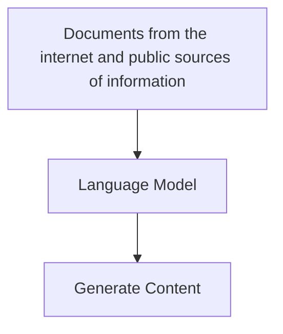

## Generative AI

- Branch of AI that enables the software applications to generate new content including text content in natural language, images, videos, code and other formats.
- The ability to generate content is based on a language model, which has been trained with huge volumes of data, often documents from the Internet or other public sources of information.

- Generative models can generate meaningful sequence of texts because they know how the words relate to one another in a language (a.k.a semantic relationship between language elements).
- The different between Large Language Models and Small Language Models depends on the volume on data and number of variables in the model.

| LLM                                           | SLM                                     |
| --------------------------------------------- | --------------------------------------- |
| Powerful, Generalize, Costly to train and use | Work well on specific topics, Cost less |

### Common uses of GenAI

- Chatbots and AI agents
- Creating new document or other content
- Automated language translation
- Summarizing or explaining complex topics.

## Computer Vision

- Computer Vision is accomplished by using large number of images to train a model.

### Image Classification

- A form of computer vision where the model is trained with labeled images. Once the model is trained, it can further take in unlabeled image and predict the most appropriate label, identifying the subject of the image.
- **Labeled Image**: An image with the description of what the image is of.
- **Unlabeled Image**: An image with no description.

### Object Detection

- A form of computer vision in which the model is trained to identify the location of specific objects in an image.
- There are more advanced forms of computer vision. For example, semantic segmentation. It is an advanced form of object detection in which rather than indicating the object's location by drawing a box around it, the model can identify the individual pixels in the image that belong to a particular object.

- The capabilities of Computer Vision and Generative AI can be combined to create a multi-modal model.

### Common uses of Computer Vision

- Auto-captioning or tag-generation for photographs.
- Visual search
- Monitoring stock levels or identifying items for checkout in retail.
- Security video monitoring
- Authentication through facial recognization.
- Robotics and self-driving vehicles.

## Speech

- Speech recognition is the ability of AI to hear and interpret speech.
- Usually this capability takes the form of speech-to-text where the audio signal for the speech is transcribed into text.

- Speech synthesis is the ability of AI to vocalize words as spoken language.
- Usually this capability takes the form of text-to-speech in which information in text format is converted into an audible signal.

- AI speech technology is rapidly evolving to handle the challenges like ignoring background noise, detecting interruptions, and generating increasingly expressive and human-like voices.

### Common uses of AI speech technologies

- Personal AI assistants in phones, computers, or household devices with which you interact by talking.
- Automated transcription of calls or meetings.
- Automating audio descriptions of video or text.
- Automated speech translation between languages.

## Natural Language Processing

- NLP capabilities are based on models that are trained to do particular types of text analysis.
- These days many NLP are handeled by generative AI models. However in many common text analytics use cases, NLP language models can be more cost effective.

### Common NLP tasks

- Entity extraction - identifying mentions of entities like people, places, organizations in a document
- Text classification - assigning document to a specific category.
- Sentiment analysis - determining whether a body of text is positive, negative, or neutral and inferring opinions.
- Language detection - identifying the language in which text is written.

### Common uses of NLP technologies

- Analyzing document or transcripts of calls and meetings to determine key subjects and identify specific mentions of people, places, organizations, products, or other entities.
- Analyzing social media posts, product reviews, or articles to evaluate sentiment and opinion.
- Implementing chatbots that can answer frequently asked questions or orchestrate predictable conversational dialogs that don't require the complexity of generative AI.

## Extract data and insights

- The fundamental for most document analysis is a technology of computer vision called Optical Character Recognization (OCR).
- While OCR model can identify the location of text in an image, more advanced models can also interpret individual values in the document and so extract specific fields.
- While most data extraction models have focused on extracting fields from text-based forms, more advanced models that can extract information from audio recordings, images, and videos are becoming more readily available.

### Common uses of AI to extract data and insights

- Automated processing of forms and other documents in a business process. for example, processing an expense claim.
- Large-scale digitization of data from paper forms. For example, scanning and archiving census records.
- Indexing documents for search.
- Identifying key points and follow-up actions from meeting transcripts or recordings.

## Responsible AI

- Fairness: AI models are trained using data, which is generally sourced and selected by humans. There's substantial risk that the data selection criteria, or the data itself reflects unconscious *bias* that may cause a model to produce discriminatory outputs. AI developers need to take care to minimize bias in training data and test AI systems for fairness.
- Reliability and safety: AI is based on probabilistic models, it is not infallible. AI-powered applications need to take this into account and mitigate risks accordingly.
- Privacy and security: Models are trained using data, which may include personal information. AI developers have a responsibility to ensure that the training data is kept secure, and that the trained models themselves can't be used to reveal private personal or organizational details.
- Inclusiveness: The potential of AI to improve lives and drive success should be open to everyone. AI developers should strive to ensure that their solutions don't exclude some users.
- Transparency: AI can sometimes seem like "magic", but it's important to make users aware of how the system works and any potential limitations it may have.
- Accountability: Ultimately, the people and organizations that develop and distribute AI solutions are accountable for their actions. It's important for organizations developing AI models and applications to define and apply a framework of governance to help ensure that they apply responsible AI principles to their work.

### Responsible AI examples

- An AI-powered college admissions system should be tested to ensure it evaluates all applications fairly, taking into account relevant academic criteria but avoiding unfounded discrimination based on irrelevant demographic factors.
- An AI-powered robotic solution that uses computer vision to detect objects should avoid unintentional harm or damage. One way to accomplish this goal is to use probability values to determine "confidence" in object identification before interacting with physical objects, and avoid any action if the confidence level is below a specific threshold.
- A facial identification system used in an airport or other secure area should delete personal images that are used for temporary access as soon as they're no longer required. Additionally, safeguards should prevent the images being made accessible to operators or users who have no need to view them.
- A web-based chatbot that offers speech-based interaction should also generate text captions to avoid making the system unusable for users with a hearing impairment.
- A bank that uses an AI-based loan-approval application should disclose the use of AI, and describe features of the data on which it was trained (without revealing confidential information).
